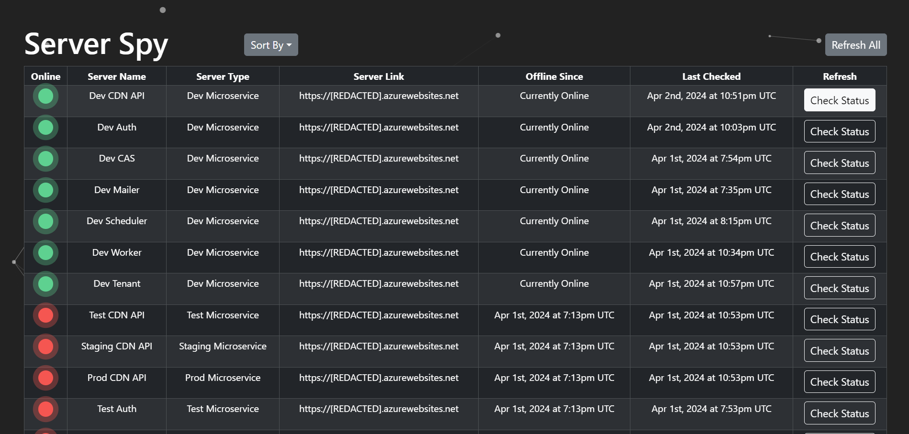

# Server Spy

## Overview
Server Spy is a simple interface to check if a predefined group of servers is live.
While individual microservice health checks can be set up and monitored in portals like Azure, AWS, and Google,
none of these portals offer an option to view all of your health checks (i.e. /live) all at once.
Unless you're also using a service like Kubernetes where you can see an overview of your cluster

## Features
- Table view showing the current status of all the servers including an easily identifiable online/offline icon
- Sort table by any column including Online Status, Server Name, Sever Type
Server Link, Offline Since, and Last Checked
- Check the status of any server in real time using the 'Check Status' button in each table row
- Dark theme with particle effect background

## Personal Goals For This Project
- Create an interface that makes it easy to check the availability of a group of servers.
- Complete a project with a modern frontend framework. React and Typescript were chosen for this project
- Create a project that has a particle effect in some form to give a liveliness to the interface

## Disclaimers
- This project is strictly educational and not for commercial use

## Gallery
### Interface

### Background Particle Animation
<video src="./assets/ServerSpyParticleAnimation.mp4" height=400></video>
